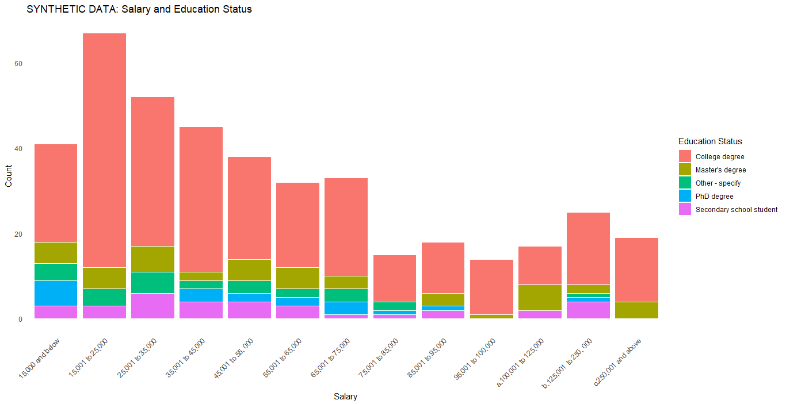

# Synthetic Data Generation & Validation Workflow Using R's bnlearn Package and Distribution Plots

## Objective  
Turn sensitive survey responses into **privacy‑safe synthetic datasets** while keeping the statistical patterns intact.  
The goal: allow analysis, sharing, and portfolio demonstration **without exposing any respondent’s real data**.

---

## Action from Results  
- Share the synthetic dataset outputs publicly without any privacy risk.
- Add to workflow for the next wave of surveys in the Data Engineering Pilipinas group.
  
---

## Findings  
- Comparable distributions per column: based on **Side‑by‑side frequency distribution plots** for every column, comparing original vs synthetic data  
- Click here to see all the plots. [Distribution Plots of Original and Synthetic Data](full_n774.pdf)
- **Salary vs. education stacked bar plots** indicate slight deviations from original dataset. This is expected based on the algorithm.
- 
- 
---

## Background  
Raw survey data often contains **personally identifiable or sensitive information** (e.g., salary).  
Directly sharing it — even internally — can breach trust or compliance rules.  
This workflow uses a **Bayesian network approach** (`bnlearn` in R) to model relationships between variables, then generates synthetic records that mimic the original dataset’s structure and distributions.  
You can read more about bnlearn here: [bnlearn documentation](https://www.bnlearn.com/documentation/)

---

## Workflow: 
- [Click here to see workflow for generating the synthetic dataset](workflow_bnlearn.txt)  
- [Click here to see workflow for generating the plots](workflow_plots.txt)
1. **Load & Preprocess**  
   - Read raw survey CSV, already cleaned of identifiers.  
   - Create an `age_grp` factor from numeric age.  
   - Remove non‑modeling columns.  
   - Normalize text encoding and replace blanks with `"CODEASBLANK"`.  
   - Convert all variables to factors for modeling consistency.

2. **Model & Synthesize**  
   - Learn Bayesian network structure via **Hill‑Climbing**. Below is the resulting network. 
   - Fit conditional probability tables.  
   - Generate synthetic datasets with the same number of rows as the original dataset. 

3. **Audit for Privacy**  
   - Tag datasets as `real` or `synthetic`.  
   - Combine and check for **exact record matches** across all factor combinations.
   - Export duplication check containing synthetic rows for deletion in a csv file.
   - Drop row_ids of synthetic dataset identified as similar to original dataset.
   - Export both original df and cleaned synthetic df for frequency distribution plots.

4. **Frequency Distributions**  
   - Compute per‑variable counts and proportions for both real and synthetic datasets.  
   - Combine into a single table for plotting.
   - Export combined long table of frequencies as csv.

5. **Visualization & Export**  
   - Loop through all variables, generating **side‑by‑side bar plots** (Original vs Synthetic).  
   - Save plots as PNGs and embed in an **HTML report** for easy review.
   - Quick check: Salary vs. Educational status stacked bar plots. 
 

---
